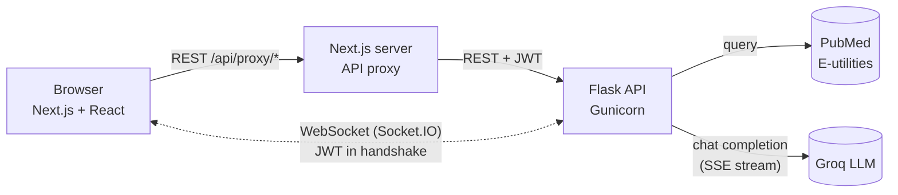

# HCP Engagement API

[](https://github.com/aadi-shah26/hcp-engagement-api/actions/workflows/ci.yml)

An AI clinical literature co-pilot for healthcare providers. A clinician searches a topic; the app pulls matching studies from PubMed and streams a Groq LLM synthesis of them into the dashboard in real time, alongside risk, cost and population analytics.

Built at HackGT 12, then extended with real-time streaming, Docker, security hardening, automated tests and CI.


## Architecture



1. The dashboard calls `/literature/search` through the Next.js proxy and renders PubMed results immediately.
2. It then emits `stream_analysis` over an authenticated WebSocket. The API builds a prompt from the top studies and opens a streaming completion with Groq.
3. Each server-sent event from Groq is forwarded to the browser as an `analysis_chunk`, so the summary appears word by word instead of after a multi-second wait.
4. If Groq is unavailable, the API falls back to a rule-based summary; if a stream breaks partway, the client gets an error rather than a stitched-together answer.

## Features

**Literature and AI**
- PubMed search built from specialty, keywords and patient conditions (with offline fallback data)
- Groq LLM synthesis streamed token by token to the dashboard over WebSockets
- Structured JSON analysis endpoint (summary, key findings, clinical implications, confidence) with parsing and rule-based fallbacks
- Configurable model (`GROQ_MODEL`); a newer search cancels the previous stream, including the upstream Groq request

**Analytics** (rule-based and statistical, not ML)
- Patient risk scoring and level, treatment cost estimation, population trends with pandas
- High-risk predictions push a real-time `notification` event to the user's open sockets

**Security**
- JWT (HS256, 1 hour expiry) on every protected REST route and on the WebSocket handshake; socket identity comes from the token, never the client payload
- bcrypt password hashing; failed logins rate-limited per username
- WebSocket origin allow-list; no hardcoded or logged secrets

**Engineering**
- Docker images for API and frontend (non-root, health-checked) and a one-command Compose stack
- Offline pytest suite (auth, rate limiting, socket auth, streaming order, cancellation, fallbacks) and GitHub Actions CI

## Tech Stack

| Layer | Tools |
|---|---|
| Backend | Python 3.11, Flask, Flask-RESTX (Swagger), Flask-SocketIO, Flask-Limiter, PyJWT, bcrypt, pandas, Gunicorn |
| AI and data | Groq API (Llama 3.x, streamed via SSE), PubMed via `pymed` |
| Frontend | Next.js 14, React 18, TypeScript, Tailwind CSS, socket.io-client |
| Infrastructure | Docker, Docker Compose, GitHub Actions |

## Quick Start (Docker)

You need Docker with Compose v2 and a free Groq API key from [console.groq.com](https://console.groq.com).

```bash
git clone https://github.com/aadi-shah26/hcp-engagement-api.git
cd hcp-engagement-api
cp hcp-engagement-api-dev/.env.example hcp-engagement-api-dev/.env
# edit .env: set GROQ_API_KEY, SECRET_KEY and JWT_SECRET_KEY
docker compose up --build
```

- App: http://localhost:3000 (demo login `demo_provider` / `demo123`)
- API docs (Swagger): http://localhost:5000/docs/
- Health: http://localhost:5000/health (`groq_integration.available` should be `true`)

Without a Groq key the app still runs, but summaries fall back to rule-based keyword matching.

## Running Without Docker

**Backend** (Python 3.11; the pinned pandas/numpy versions don't support 3.12+)
```bash
cd hcp-engagement-api-dev
python3 -m venv venv && source venv/bin/activate
pip install -r requirements.txt
cp .env.example .env    # fill in values
python3 app.py
```

**Frontend** (Node.js 18+)
```bash
cd hcp-frontend
npm install
npm run dev
```

## Configuration

Backend (`hcp-engagement-api-dev/.env`, see [`.env.example`](hcp-engagement-api-dev/.env.example)):

| Variable | Purpose |
|---|---|
| `GROQ_API_KEY` | Groq API key (AI features fall back to rules without it) |
| `GROQ_MODEL` | Default model, `llama-3.1-8b-instant` unless set |
| `SECRET_KEY`, `JWT_SECRET_KEY` | Signing secrets; if unset, random per-process values are used and tokens reset on restart |
| `ALLOWED_ORIGINS` | Browser origins allowed to open a WebSocket |

Frontend:

| Variable | Purpose |
|---|---|
| `BACKEND_URL` | Where the Next.js proxy sends API calls (server-side, default `http://localhost:5000`) |
| `NEXT_PUBLIC_SOCKET_URL` | Where the browser opens the WebSocket (build time, default `http://localhost:5000`) |

## API Reference

All routes except login and health need `Authorization: Bearer <token>`. Interactive docs are at `/docs/`.

| Method | Route | Description |
|---|---|---|
| POST | `/auth/login` | Returns a JWT for `{username, password}` |
| POST | `/literature/search` | PubMed search, optionally with Groq JSON analysis (`enable_ai_analysis`) |
| POST | `/ai/analyze` | Free-text Groq analysis |
| GET | `/ai/models` | Allowed Groq models and availability |
| POST | `/analytics/predict-risk` | Rule-based patient risk score |
| POST | `/analytics/predict-cost` | Treatment cost estimate |
| POST | `/analytics/population-trends` | Population statistics |
| GET | `/health` | Service and Groq status (public) |

### WebSocket (Socket.IO)

```js
const socket = io('http://localhost:5000', { auth: { token } });  // refused without a valid JWT
socket.emit('stream_analysis', { request_id, studies, specialty, keywords, patient_conditions });
socket.on('analysis_chunk', ({ request_id, delta }) => { /* append text */ });
socket.on('analysis_done',  ({ request_id, source }) => { /* source: groq | rule_based_fallback | groq_interrupted */ });
socket.on('analysis_error', ({ request_id, message }) => { /* stream broke partway */ });
```

## Testing

```bash
cd hcp-engagement-api-dev
pip install -r requirements-dev.txt
pytest
```

The suite runs offline against a fake Groq server and checks, among other things, that tokens arrive incrementally rather than buffered. CI runs it on every push together with the frontend build and both Docker image builds.

## Design Notes

- **Single Gunicorn worker with threads.** Socket sessions, stream state and rate-limit counters live in process memory. Scaling out would mean a Redis message queue for Socket.IO, shared limiter storage and sticky sessions.
- **Threading mode for Socket.IO.** Groq and PubMed calls use blocking `requests`; under an un-patched eventlet loop they would stall every other client until each call finished.
- **REST through the proxy, WebSocket direct.** The Next.js proxy avoids CORS for REST; the socket connects straight to the API, guarded by the JWT handshake and an origin allow-list.
- **Per-username login limit.** Behind the proxy every request shares one IP, so limiting by IP would lock out all users at once.

## Project Structure

```
hcp-engagement-api/
├── docker-compose.yml
├── .github/workflows/ci.yml
├── hcp-engagement-api-dev/        # Flask API
│   ├── app.py
│   ├── Dockerfile
│   ├── requirements.txt / requirements-dev.txt
│   ├── tests/                     # automated pytest suite
│   └── scripts/                   # manual smoke checks against a running server
└── hcp-frontend/                  # Next.js frontend
    ├── Dockerfile
    └── src/app/
        ├── login/
        ├── dashboard/             # search, streaming summary, analytics
        └── api/proxy/             # REST proxy to the API
```

## Limitations

- Demo users are hardcoded; there is no user registration or database.
- Risk, cost and population analytics are rule-based demonstrations, not validated clinical models.
- Patient context is sent to a third-party LLM, so this is not suitable for real patient data (no HIPAA controls).

## Credits

Built at HackGT 12 with [@aandrx](https://github.com/aandrx). Licensed under the MIT License (see [LICENSE](LICENSE)).
